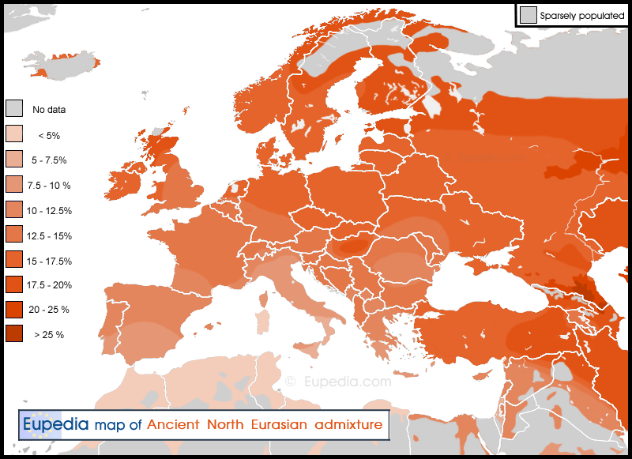
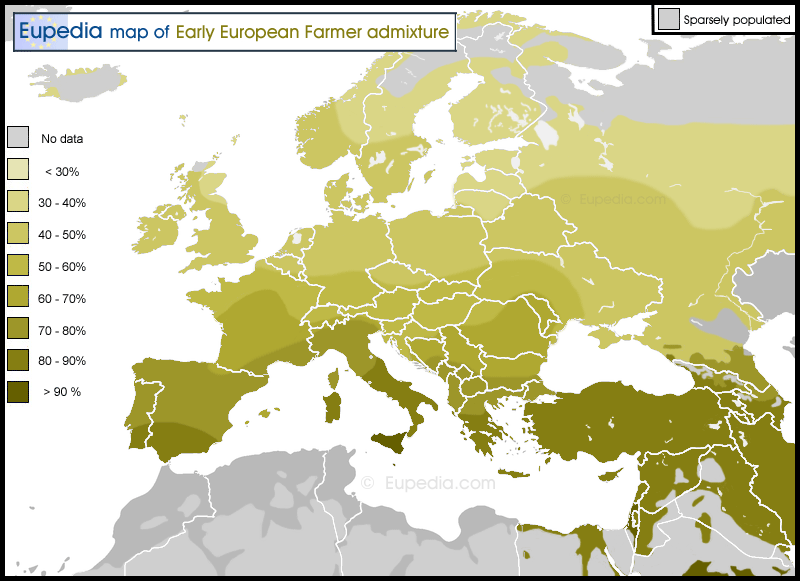
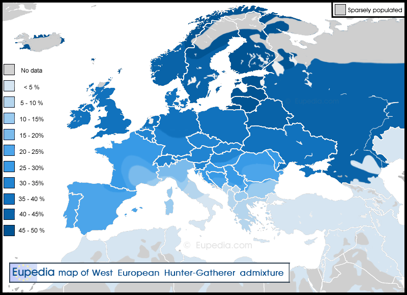
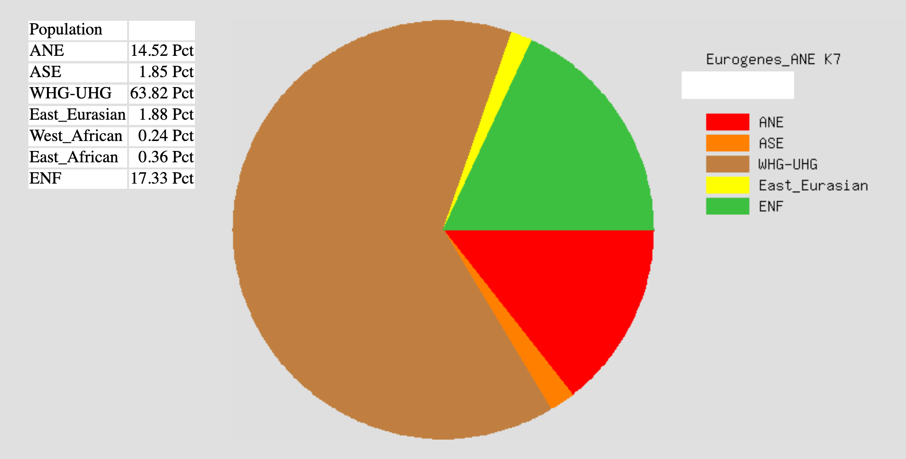

# Ancestry and diet

## Some essential European history

There are branches of people that have diverged from each other and evolved
separately for thousands of years. Let's focus on Europe. From
[this page](https://en.wikipedia.org/wiki/Genetic_history_of_Europe)
we can learn the following:

> By the end of the last glacial maximum, after 20k years ago, A Western
> European lineage, dubbed Western Hunter-Gatherer (WHG) emerges from the
> Solutrean refugium [that is, around modern day Spain] during the European
> Mesolithic.
>
> These mesolithic hunter-gatherer cultures are substantially replaced in the
> Neolithic Revolution by the arrival of Early European Farmers (EEF) lineages
> derived from mesolithic populations of West Asia (Anatolia and the Caucasus).
>
> In the European Bronze Age, there were again substantial population
> replacements in parts of Europe by the intrusion of Ancient North Eurasian
> (ANE) lineages from the Pontic–Caspian steppes. These Bronze Age population
> replacements are associated with the Beaker culture archaeologically and with
> the Indo-European expansion linguistically.

Modern European populations are thus distinguished primarily by their different
WHG, EEF and ANE ancestry. Maps showing admixture for these lineages can be
found in below, or in
[this link](https://eupedia.com/europe/autosomal_maps_dodecad.shtml#EEF-WHG-ANE).

A few pages you should read or skim through are the following.

- Overviews
  - https://en.wikipedia.org/wiki/Indo-European_migrations
  - https://en.wikipedia.org/wiki/Genetic_history_of_Europe
- People groups
  - https://en.wikipedia.org/wiki/Ancient_North_Eurasian
  - https://en.wikipedia.org/wiki/Western_Hunter-Gatherer
  - https://en.wikipedia.org/wiki/Eastern_Hunter-Gatherer
  - https://en.wikipedia.org/wiki/Caucasus_Hunter-Gatherer
  - https://en.wikipedia.org/wiki/Scandinavian_Hunter-Gatherer
  - https://en.wikipedia.org/wiki/Western_Steppe_Herders
  - https://en.wikipedia.org/wiki/Early_European_Farmers

## Rash decisions

Now I'll move on to the reason why I'm writing this.

For probably more than 10 years of my life I had a skin rash that got quite
annoying at times. My chest and arms would break out in red patches and white
dots that would itch terribly, often waking me up at night. I went to two
different dermatologist. One said "shower less, about 3-4 times a week".
Uhh, okay. Another diagnosed me with two skin conditions (atopic dermatitis
and something else) and prescribed me special creams. They made the rash
withdraw slightly but as soon as I stopped using them it got just as bad as
before. I asked him if diet could have any effect, he said no. Was I doomed?

Well, apparently not. He was wrong. I have ZERO issues now. How?!

It's difficult to exactly pinpoint when the skin problems disappeared, but
my inuition and experience tells me I'm on the right track here...

All it took was a significant diet change. I stopped eating potatoes, rice,
cereal, vegetables (with some exceptions), and some more. I now eat mainly red
meat, liver, seafood, eggs, dairy, and fermented foods like sauerkraut and
kefir, with a moderate amount of fruit.

Strange, huh?

Not really, when you also consider my ancestry.

It turns out I'm primarily descended from nomadic peoples, steppe peoples.
Analysis of my DNA suggests the following.

In other words, about 80% hunter-gatherer / steppe.

Why is this important?

## Genetics matter, but not in the way you think

Let's talk about milk. It took many thousands of years for a significant amount
of the European population to become able to drink cow's milk.

> The ability to digest lactose into adulthood evolved in several human
> populations independently, probably as an adaptation to the domestication
> of dairy animals 10,000 years ago.
>
> [Wikipedia - Lactose intolerance](https://en.wikipedia.org/wiki/Lactose_intolerance)

**In other words, for a population to adapt to a "new" food takes a _long_ time.**

Think about this for a while...

And then consider that potatoes came to Europe less than 500 years ago...

And then consider that rice came to Europe between 1000-500 years ago...

Then ask yourself... why the FUCK are potato and rice considered staples in
Europe, when many Europeans can't even drink milk?! Potatoes are native to parts
of western South America! Not Europe! They had thousands of years to adapt to
eating potatoes and rice, while Europeans had not even a millenia to do it!
Don't believe me? Look it up!

**Potato:**

> The potato was first domesticated in the region of modern-day southern Peru
> and extreme northwestern Bolivia between 8000 and 5000 BC. Cultivation of
> potatoes in South America may go back 10,000 years, but tubers do not
> preserve well in the archaeological record, making identification difficult.
>
> [Wikipedia - History of the potato](https://en.wikipedia.org/wiki/History_of_the_potato)

**Rice:**

> The Moors brought Asiatic rice to the Iberian Peninsula in the 10th century.
> Records indicate it was grown in Valencia and Majorca. In Majorca, rice
> cultivation seems to have stopped after the Christian conquest, although
> historians are not certain.
>
> Muslims also brought rice to Sicily with cultivation starting in the 9th
> century, where it was an important crop long before it is noted in the plain
> of Pisa (1468) or in the Lombard plain (1475), where its cultivation was
> promoted by Ludovico Sforza, Duke of Milan, and demonstrated in his model
> farms.
>
> After the 15th century, rice spread throughout Italy and then France, later
> propagating to all the continents during the age of European exploration.
>
> [Wikipedia - Rice](https://en.wikipedia.org/wiki/Rice)

### Where am I going with this?

Everywhere today attempts are made to propose an universal diet, a single diet
that will work for everyone on earth.

That is fucking stupid!

Groups of people have developed in different climates and environments for
thousands of years. There is significant genetic difference between a Sardinian
person (high ENF admixture) and a person of the Mari people (likely high ANE /
hunter-gatherer admixture) in modern-day Russia, although both are technically
"European" or "white". These people have developed separately for thousands of
years, just like their ancestors!
**And they will benefit from different diets!**

## Conclusion

First, consider doing a DNA test to find out your ancestry. If not, try to guess
based on phenotype and known ancestry (your family history).

Then, figure out what sort of diet was likely natural to your ancestors, or to
the ancestors which constitute most of your genetic admixture.

Then, experiment.

Then, you might start thinking about how ancestry affects other things...

(Potatoes might actually be fucking terrible for you. Check out
[this link](http://www.allergiesexplained.com/pages/Potato%20Allergy%20and%20Intolerance.htm))
